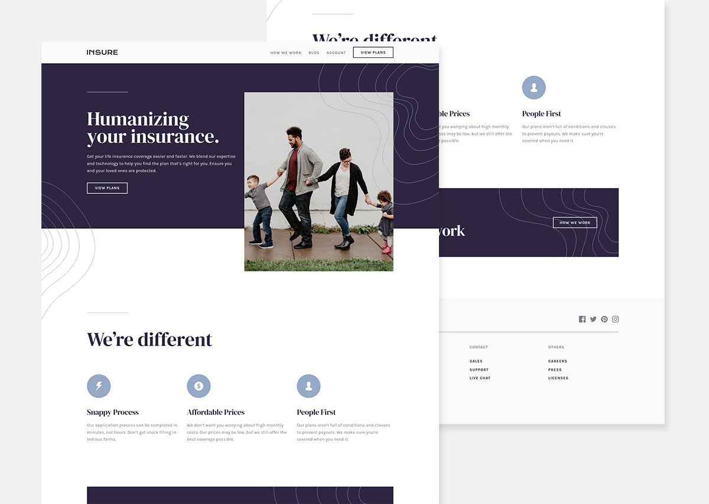

# Frontend Mentor - Insure landing page

This is a solution to the [Insure landing page challenge on Frontend Mentor](https://www.frontendmentor.io/challenges/insure-landing-page-uTU68JV8). 

## Users should be able to:

- [x] View the optimal layout for the site depending on their device's screen size
- [x] See hover and focus states for all interactive elements on the page
- [x] Navigate through the content using assistive technologies

## Preview site

:computer: <https://dusan-b.github.io/fm-insure-landig-page/>

## Built with

- Semantic HTML5 markup
- SASS/SCSS
- Flexbox and Grid
- BEM
- WebP images with fallbacks
- Mobile-first workflow
- JavaScript

## What I learned

While working on this project, I was able to expand my knowledge on how to make websites faster and more accessible. Among other things, I used the Firefox Dev Tools and Lighthouse more actively for this, which gave me a better understanding of how to improve the quality of my built web sites.

### Inline SVG

To reduce the number of network requests and thus the loading time, I decided to use inline SVG elements.

In the process, I learned how to resize an inline SVG image using CSS. To make SVG images adapt dynamically to the user's browser settings (font size), I specified the sizes in rem units.

I also figured out how to make SVG images accessible to assistive technologies. I followed a technique described in the article [Accessible SVGs](https://css-tricks.com/accessible-svgs/) that seems to work perfectly. For testing purposes, I used the Linux-based screen reader Orca.

### Background overflow

To allow the two background images in the hero section to break out of their parent element, like in the original design, I came up with the solution of creating a separate `
` with the respective background images, setting `position` to `absolute` and specifying negative values for `bottom`. I think it's a bit of a hacky approach, but it works and doesn't affect the funcionality of the web page.

### Other aspects I have practiced and used

- Appropriate use of the `aria-label` and `aria-labelledby` attributes
- A design based focus outline for keyboard users with a complementary color scheme
- Animated mobile menu using `transform` and `transition-delay`

## Useful resources

- [Accessible SVGs](https://css-tricks.com/accessible-svgs/)
- [Revisting aria-label versus a visually hidden class](https://gomakethings.com/revisting-aria-label-versus-a-visually-hidden-class/)
- [When to use aria-label or screen reader only text](https://bootcamp.uxdesign.cc/when-to-use-aria-label-or-screen-reader-only-text-cd778627b43b)
- [aria-label - examples and best practices](https://www.aditus.io/aria/aria-label/)
- [How To Design Useful and Usable Focus Indicators](https://www.deque.com/blog/give-site-focus-tips-designing-usable-focus-indicators/)

---

**Created by Dusan Brankov**

Frontend Mentor — [@dusan-b](https://www.frontendmentor.io/profile/dusan-b)